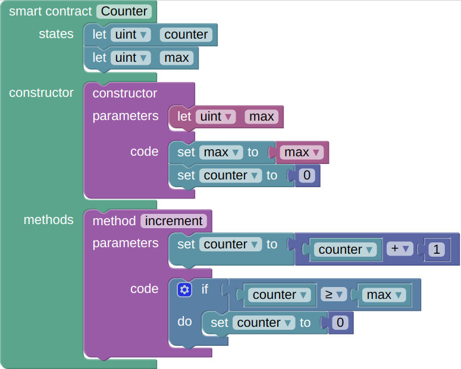

# Solidity for Blockly

## About

This projects goal is to add support for the [Solidity](https://solidity.readthedocs.io) language (the main language
used to create smart contracts for the [Ethereum](https://www.ethereum.org/) blockchain) in the
[Blockly](https://developers.google.com/blockly/) visual programming tool.

## Motivations

I see a lot of articles here and there stating that the blockchain makes it possible to build decentralized
communities. Those articles are completely oblivious to the fact that even if smart contracts execution is indeed
enforced by a decentralized blockchain network, those contracts are still written by actual developers.

Taking into account that "code is law", the ability to actually write smart contracts becomes a new logical SPOF.
No true decentralized community will ever exist as long as the production of its code (its "laws") is not accessible
to just any of its members.

Thus, the need to make it easier to create, distribute and run smart contracts with as less technical skills as
possible. Blockly being an initiative to introduce programming to children, it felt like the right way to start
experimenting.

## Install

* `mkdir www && cd www`
* `git clone https://github.com/google/blockly.git`
* `git clone https://github.com/promethe42/blockly-solidity.git`
* `python -m SimpleHTTPServer`

Then open http://localhost in your favorite web browser.

## Features

* support for the `bool`, `int` and `uint` types
* smart contract states, constructor and methods
* declaration, read and assignation of contract states
* declaration and read of method parameters
* math operators `+`, `-`, `/`, `x`
* `if then else` control structures
* scopes for contract states and method parameters
* type-safe state assignations
* state/method parameters name & type refactoring

I'm guessing other features (such as loops and more complex math/logical expressions) might work, but
I didn't have enough time to test them.

## Todo

* variables
* scoped variables
* compile the generated Solidity code
* one-button deployment of the compiled contract

## Example

This Blockly program:



will generate the following Solidity code:

```solidity
pragma solidity ^0.4.2;

contract Counter {
  uint counter = 0;
  uint max = 0;
  function () { throw; }
  function Counter(uint max) {
    this.max = max;
    this.counter = 0;
  }
  function increment(this.counter = this.counter + 1;) {
    if (this.counter >= this.max) {
      this.counter = 0;
    }
  }
}
```
